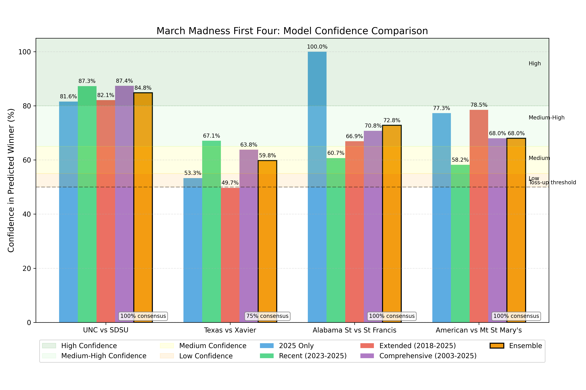
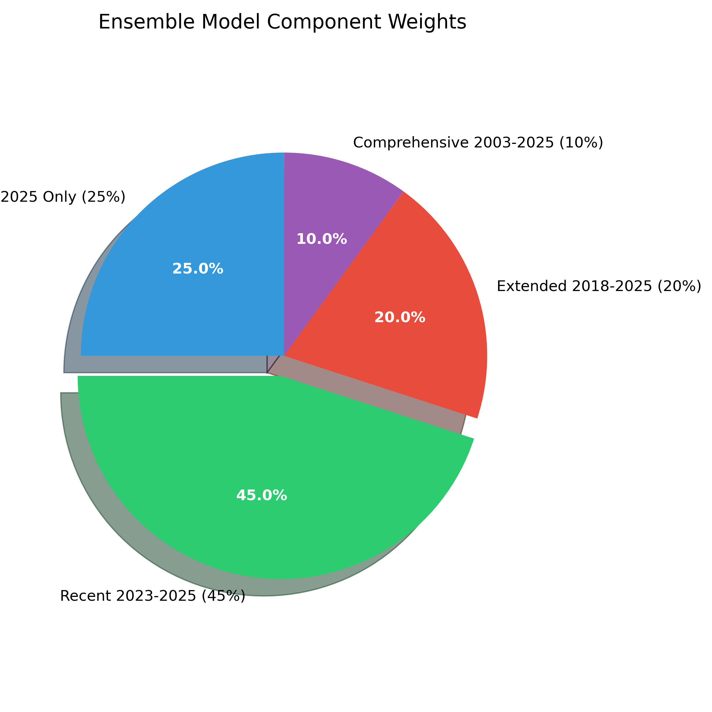

# March Madness Prediction System

A machine learning system for predicting NCAA basketball tournament outcomes, based on multiple historical timeframe approaches using Random Forest classification.

## Overview

This project adapts a Random Forest implementation originally developed for tennis match predictions to predict NCAA March Madness basketball tournament outcomes. The system uses KenPom basketball statistics to generate predictions with varying levels of historical context.



## Key Features

- **Multiple Timeframe Models**: Implementations using different historical periods:
  - Current Season Only (2025)
  - Recent Seasons (2023-2025) with trend analysis
  - Extended History (2018-2025)
  - Comprehensive History (2003-2025)
  
- **Weighted Ensemble Approach**: Combines all models with optimized weights:
  

- **Team Performance Trend Analysis**: Detects team improvement or decline patterns across seasons
  
- **Advanced Name Matching**: Handles team name inconsistencies across datasets with fuzzy matching

- **Comprehensive Feature Engineering**: Creates team differential metrics for matchup prediction

## File Structure

- **Core Implementation:**
  - `BasketballUtils.py`: Core utility functions
  - `RandomForest/RandomForest.py`: Custom Random Forest implementation
  - `DecisionTree/DecisionTree.py`: Custom Decision Tree implementation

- **Prediction Scripts:**
  - `predict_first_four.py`: All training data
  - `predict_first_four_2025_only.py`: Current season only
  - `predict_first_four_extended.py`: 2018-2025 data
  - `predict_first_four_comprehensive.py`: 2003-2025 data
  - `predict_first_four_recent.py`: 2023-2025 data with trend analysis
  - `predict_with_ensemble.py`: Weighted ensemble of all approaches
  
- **Analysis and Testing:**
  - `MarchMadness.ipynb`: Core analysis notebook
  - `test_basketball_utils.py`: Tests core functionality
  - `test_bracket_simulation.py`: Tests bracket simulation
  - `test_model_performance.py`: Compares model performance

- **Results:**
  - `first_four_*_predictions.txt`: Prediction outputs from each model
  - `first_four_ensemble_predictions.txt`: Ensemble model predictions
  - `model_comparison_results.md`: Detailed comparison of all models
  - `final_model_summary.md`: Final analysis and recommendations

## Prediction Components

1. **Data Processing**
   - Merges and cleans KenPom basketball metrics
   - Creates team statistical matchup differentials
   - Handles different data formats across seasons

2. **Team Name Matching**
   - Resolves team name inconsistencies across datasets
   - Implements fuzzy matching for team name variations
   - Maintains common name mapping dictionary

3. **Model Training**
   - Trains Random Forest models on different historical timeframes
   - Implements weighted sampling to balance recent vs. historical data
   - Optimizes hyperparameters for each timeframe approach

4. **Trend Analysis**
   - Tracks team performance metrics across seasons
   - Identifies improvement or decline patterns
   - Classifies teams on five-point trend scale

5. **Prediction Generation**
   - Creates matchup-specific statistical analysis
   - Provides confidence levels with appropriate interpretation
   - Includes tournament context (historical seed performance)

6. **Ensemble Integration**
   - Combines multiple models with optimized weights
   - Incorporates model consensus metrics
   - Balances confidence levels across approaches

## First Four Predictions

The system has been tested on NCAA First Four play-in games with the following predictions:

1. **South Region #11 Seed**: North Carolina over San Diego State (84.8% confidence)
2. **Midwest Region #11 Seed**: Texas over Xavier (59.8% confidence)
3. **South Region #16 Seed**: Alabama State over Saint Francis (72.8% confidence)
4. **East Region #16 Seed**: American over Mount St. Mary's (68.0% confidence)

## Usage

To run the ensemble prediction system:

```bash
python predict_with_ensemble.py
```

For individual timeframe models:

```bash
python predict_first_four_recent.py  # For recent data model
python predict_first_four_2025_only.py  # For current season only
```

## Development

This system can be extended beyond First Four games to predict the entire tournament. The modular architecture allows for easy addition of new data sources and prediction approaches.

## Future Enhancements

- Extend to full tournament bracket prediction
- Incorporate additional metrics (recruiting rankings, coaching experience)
- Develop interactive visualization dashboard
- Implement live-updating predictions during the season
- Create tournament simulation system with confidence intervals